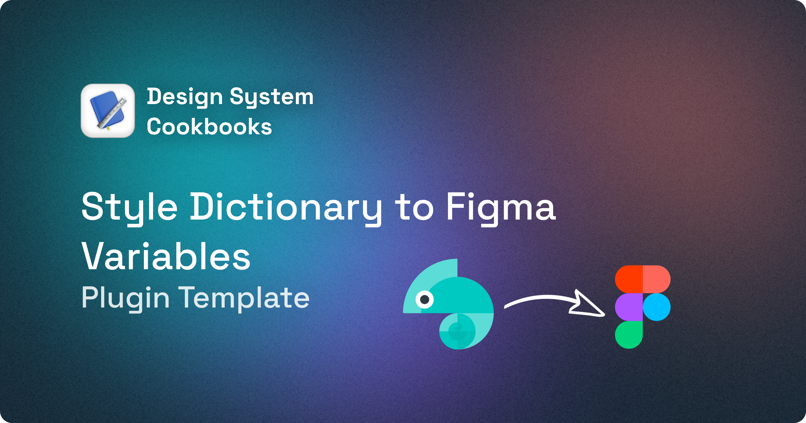

---

To sync Style Dictionary tokens with Figma, there is an API approach, but it's only available for Enterprise accounts 😢 This plugin uses the plugin API to sync the tokens with Figma.

<video src="https://raw.githubusercontent.com/konsalex/style-dictionary-to-figma/blob/main/assets/demo.mp44" autoplay loop muted></video>

### How to use

This is a template plugin, so to use it properly you would have to follow the next steps:

1. Clone the repo.
2. Copy your own JavaScript toke file to the `src/tokens.js`. There is an example `token.js` file that is generated with `style-dictionary`.
3. Modify the `utils.ts` file to match your own design tokens schema.
4. Install packages, build the plugin and then load it inside Figma.
5. Run the plugin and voilà ✨

### Read more

To read more about the plugin template visit this [blog post](https://designsystemcookbooks.com/blog/figma-styled-to-variables).

### Frequent issues

1. Use Development VM may break with `lodash`. [Disable it](https://github.com/figma-plugin-helper-functions/figma-plugin-helpers/issues/80#issuecomment-1336549083).
2. Be sure to have the collection and the modes created beforehand otherwise the plugin will not work as expected. To create the modes a priori, you will need a placeholder token in place.

### Contributions

Any contributions are welcome 🧑‍💻 